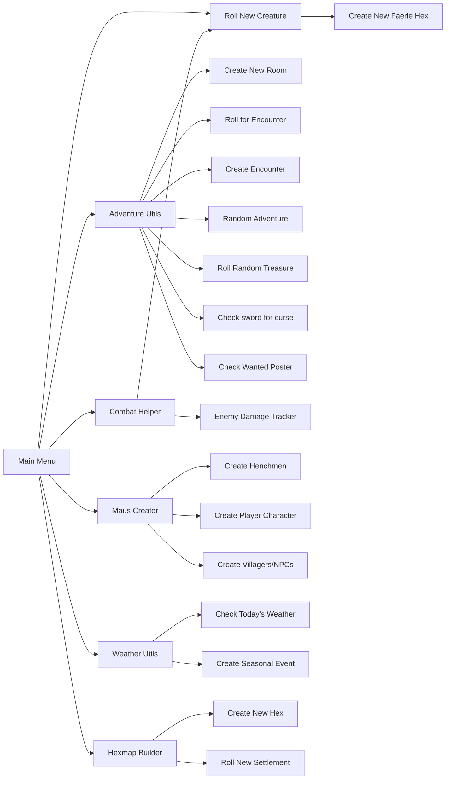

# Python RPG Helpers
This is a set of python scripts meant to help run RPG games. Includes scripts for:
* Mappa Imperium
* Mausritter

## Mappa Imperium
Use [this link](https://nookrium.itch.io/mappa-imperium) to find the Mappa Imperium User manual. The scripts included in this repository include the chance tables, and perform dice rolls accordingly.

## Mausritter
Use [this link](https://mausritter.com/) to find the Mausritter user manual. The scripts included in this repository include chance tables from this manual, and
can perform many of the die rolls to generate characters, locations, quests, treasure, etc.

### Utility Layout
Below is an overview of the Mausritter Helper utilities:

