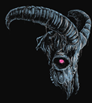
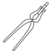

# Table of Contents
- [Factions](factions.md)
    - [Barrows Ravagers](factions.md#barrows-ravagers)
    - [Nephilim](factions.md#nephilim)
- [Tribes](factions.md)
    - [Forked Tongues](factions.md#forked-tongues)
    - [Inganae](factions.md#inganae)
- [Pantheon](#history)
    - [Goran](#history)
    - [Narnova](#history)
    - [Ankai](#history)
- [History](#history)
    - [The Beginning](#the-beginning)
    - [Age of Discovery](#age-of-discovery)

# History

## The Beginning

### Ankai, god of the skies

### Goran, god of the Mountain

### Narnova, goddess of the Hearth

## Age of Discovery

**Colonization.** The Nephalim take to the seas in their giant canoes! Paddling for what couldn’t have been more than 5 minutes, they hastily arrive on the shores of Lake Loch Island; a new land awaits! Eager settlers flock to the new village and before long the bustling coastal town of Kanoodear was born. But soft, what light through yonder window breaks? Tis the lizardfolk across the water, surely this expansion will be consequence free...

**Ancient Ruins.** Scouts return to the Dread Keep, with news of the surrounding world. It has been known that Narnova (goddess of the hearth) is a dominant force upon these lands, but signs indicate a second god, Goran. 
Nearby, to the East, lies the frosted isle. Scouts report spotting the ruins of a once great city upon the island. No worldly power could have wrought such destruction, and few know the wrath of an angry god better than the Barrow Ravagers. Perhaps another temple is required...
