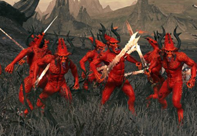
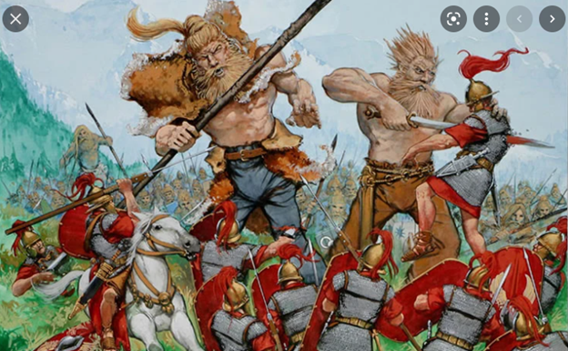
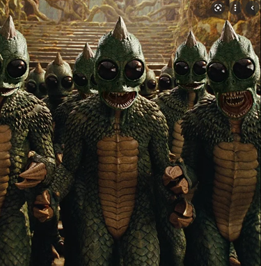
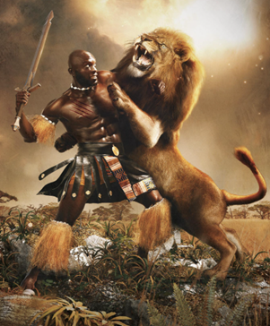

# Barrows Ravagers

Driven from their home by the great and terrible *illegible*, the *illegible* fled to an adjacent world. Upon settling an abandoned island, they realized they had no natural resources whatsoever. 
After descending upon and slaying *illegible* (for it was he who scouted and chose the location to settle) it was discovered that the island was home to generation upon generation of barrows. The *illegible* were henceforth known as The Barrows Ravagers, they erected a fortress, and began mining the only resource available to them…..

## Sigil

# Nephilim

Long ago, war broke out in the heavens. Slaying as many of the gods as he could find, Ankai rose victorious. For their refusal to help aid Ankai in his quest for dominion, the Nephilim were cast from the skies and bound to the mortal realms. Long ages have past and the once destitute and broken Nephilim have grown into a burgeoning society, founding their capital city near the Deep wood, the Stronghold of Uruk.

## Sigil

# Forked Tongues

The Forked Tongues are an old race, their kind had seen kingdoms rise and fall long before recorded history. Once a prosperous nation spanning many lands, their greatness came to a crashing halt as their mighty empire crumbled abruptly. Casting down the Nephilim from the skies, what was a peaceful lizard day turned tragic as Ankai hurled the giants from his realm. Crashing in mostly one large clump, to the bugged-out eyes of the Forked Tongues their doom came in what appeared to them as a great meteor falling from above. The impact of the many Nephilim sent a mighty shock wave across the land, throwing dust into the sky. This traumatic event launched a decade of frost and famine, killing the vast majority of the cold-blooded FT’s. Now all that remains of their vast and ancient culture is their home city of Toi Saurus, from which they worship the very god who caused their demise, begging his help to return the giant menace back to the skies from whence they came. 

# Inganae

The Inganae tribe is a proud people, with a long and storied heritage. They were once a thriving fishing community, with boats that were less than sea worthy, but adequate for near-shore fishing… Until the great light.
There was a great blinding light, and the peaks of the frosted twins showed vibrant in the distance. The chieftan Urglaburgha decided that this was the work of a new young god, Gorgon. When the other chieftan’s claimed that Urlaburgha was a heretic, civil war ensued.

The Inganae are now lead by Urglaburgha, and have made it their mission to worship the god Gorgon, and kill any who oppose him. Their numbers are reduced, but their motivation is strong, and their blind devotion to Gorgon (and by extension, Urgla) makes them a potential threat to any who stand in their way….

[Main Page](README.md)
